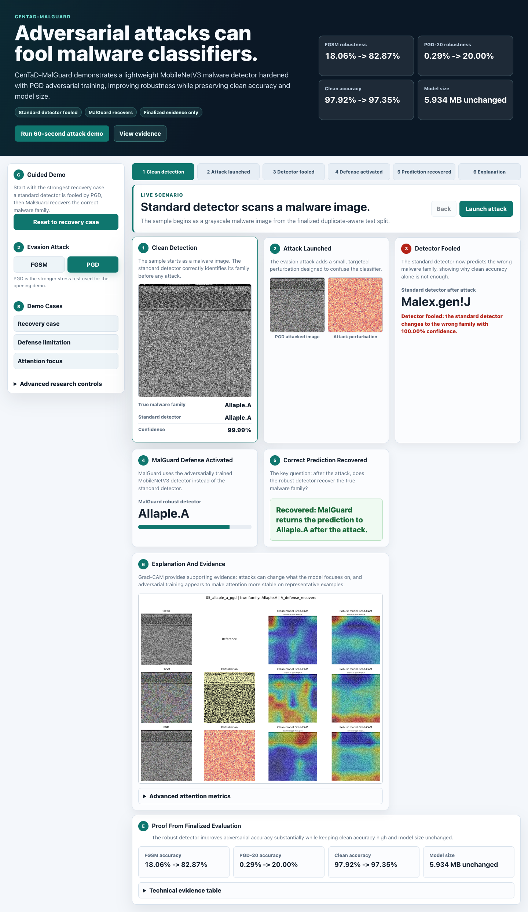
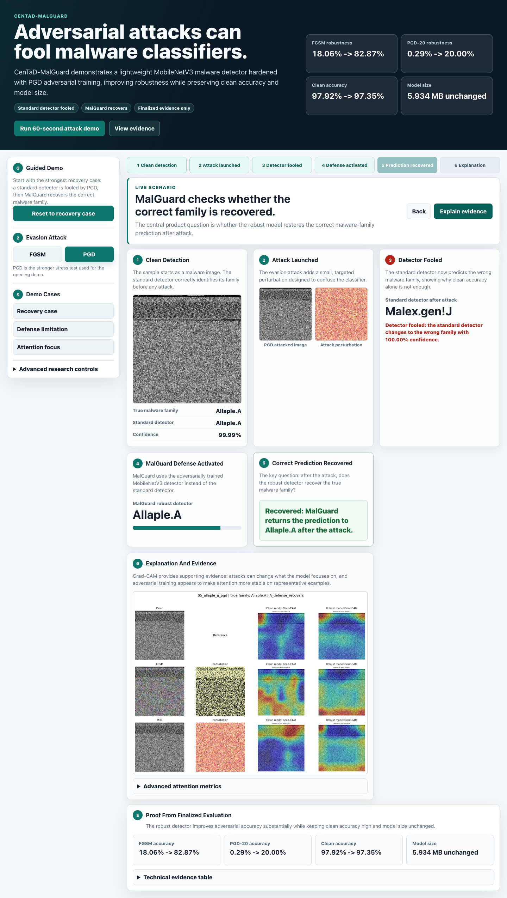
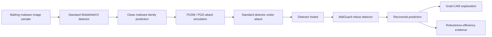

# CenTaD-MalGuard

**A lightweight adversarially robust malware image classification demonstration system.**

CenTaD-MalGuard shows a concrete cybersecurity problem: a malware classifier can look accurate on clean samples but fail under adversarial attack. The project demonstrates that PGD adversarial training can harden a lightweight MobileNetV3 malware image classifier while preserving nearly all clean accuracy and model efficiency.



## 60-Second Summary

**Problem:** Adversarial attacks can fool malware classifiers.

**Solution:** CenTaD-MalGuard uses PGD adversarial training to improve the robustness of a lightweight MobileNetV3 malware detector.

**Result:** Robustness improves substantially with almost no clean-accuracy loss and no model-size increase.

| Metric | Standard MobileNetV3 | MalGuard Robust MobileNetV3 | Change |
|---|---:|---:|---:|
| Clean Accuracy | 97.92% | 97.35% | -0.57 percentage points |
| FGSM Accuracy, eps=0.03 | 18.06% | 82.87% | +64.80 percentage points |
| PGD-20 Accuracy | 0.29% | 20.00% | +19.71 percentage points |
| Model Size | 5.934 MB | 5.934 MB | unchanged |

## Why This Matters

Malware image classification converts malware binaries into image-like representations and classifies malware families with computer vision models. These models can achieve high clean accuracy, but cybersecurity systems must also resist deliberate manipulation.

This project shows that clean accuracy alone is not enough. The official MobileNetV3 baseline reached **97.92% clean accuracy**, but dropped to **0.29% accuracy under PGD-20**. CenTaD-MalGuard addresses this by adversarially training the same lightweight architecture, improving robustness without increasing parameter count or model size.

## Innovation

CenTaD-MalGuard is not just a classifier report. It is an end-to-end adversarial robustness solution package:

- duplicate-aware malware image evaluation to reduce leakage risk
- FGSM and PGD attack evidence showing how the standard detector fails
- PGD adversarial training that hardens MobileNetV3 without increasing model size
- Grad-CAM evidence showing how attacks can alter model attention
- a judge-facing demo that communicates the full security story in minutes

The main contribution is the robustness-efficiency result: the robust model keeps the **same 5.934 MB footprint** while improving FGSM accuracy from **18.06% to 82.87%** and PGD-20 accuracy from **0.29% to 20.00%**.

## Demo

Run the local demo from the repository root:

```bash
python3 -m http.server 8765
```

Open:

```text
http://localhost:8765/demo/centad-malguard/
```

If the project virtual environment is available:

```bash
./venv/bin/python -m http.server 8765
```

The judge-facing demo follows this flow:

```text
clean detection -> attack launched -> detector fooled -> MalGuard defense -> prediction recovered -> evidence
```

Recommended opening example:

```text
05_allaple_a_pgd
```

This example shows the standard detector correctly classifying `Allaple.A`, then being fooled by PGD into predicting `Malex.gen!J`, while the MalGuard robust detector recovers `Allaple.A`.



## System Architecture



## Experimental Design

Official protocol:

- Dataset: MalImg malware image dataset
- Classes: 25 malware families
- Split: duplicate-aware train/validation/test split
- Duplicate control: image-content SHA-256 grouping
- Baselines: MobileNetV3 Small and EfficientNet-B0
- Attacks: FGSM and PGD in raw pixel space
- Defense: PGD adversarial training for MobileNetV3
- Explainability: Grad-CAM on curated clean, FGSM, and PGD examples

## Key Findings

### 1. Duplicate-aware evaluation matters

The original stratified split had no file-path overlap, but image-content hashing found exact duplicate images across train/validation/test. The project switched to a duplicate-aware protocol that keeps identical content hashes in the same split. All official results use this corrected protocol.

Official duplicate-aware split:

| Split | Samples |
|---|---:|
| Train | 6,539 |
| Validation | 1,405 |
| Test | 1,395 |

### 2. Lightweight clean baselines are accurate

| Model | Accuracy | Macro F1 | Parameters | Model Size |
|---|---:|---:|---:|---:|
| MobileNetV3 Small | 97.92% | 93.53% | 1,543,481 | 5.934 MB |
| EfficientNet-B0 | 96.06% | 87.99% | 4,039,573 | 15.57 MB |

MobileNetV3 was selected as the primary solution target because it was both more accurate and substantially smaller.

### 3. Adversarial attacks break the standard detector

| Attack | Model | Accuracy | Macro F1 | Attack Success Rate |
|---|---|---:|---:|---:|
| FGSM eps=0.03 | MobileNetV3 | 18.06% | 3.22% | 81.63% |
| PGD-10 eps=0.03 | MobileNetV3 | 0.72% | 0.39% | 99.27% |
| PGD-20 eps=0.03 | MobileNetV3 | 0.29% | 0.07% | 99.71% |

### 4. PGD adversarial training improves robustness

| Metric | Standard MobileNetV3 | MalGuard Robust MobileNetV3 |
|---|---:|---:|
| Clean Accuracy | 97.92% | 97.35% |
| FGSM Accuracy, eps=0.03 | 18.06% | 82.87% |
| PGD-10 Accuracy | 0.72% | 42.94% |
| PGD-20 Accuracy | 0.29% | 20.00% |
| Parameters | 1,543,481 | 1,543,481 |
| Model Size | 5.934 MB | 5.934 MB |
| Latency | 1.259 ms | 1.162 ms |

### 5. Grad-CAM supports the robustness story

Grad-CAM visualizations show that adversarial attacks can change model attention. On the curated evidence set, the adversarially trained model had higher Top-20% heatmap overlap and lower center-of-mass shift than the standard model under both FGSM and PGD.

| Model | Attack | Top-20% IoU Mean | Center-Shift Mean |
|---|---|---:|---:|
| Standard | FGSM | 0.0905 | 0.1159 |
| MalGuard | FGSM | 0.3364 | 0.0822 |
| Standard | PGD | 0.1355 | 0.0782 |
| MalGuard | PGD | 0.3607 | 0.0617 |

This is supporting evidence, not proof that the model semantically understands malware structure.

## Repository Structure

```text
attacks/                 FGSM and PGD attack/evaluation code
configs/                 Official experiment configuration files
defenses/                PGD adversarial training implementation
demo/centad-malguard/    Judge-facing static demo application
docs/                    Demo guide and repository audit
evaluation/              Metrics, confusion matrix, latency, and benchmark helpers
manifests/               Dataset/split/environment manifests, local artifact
models/                  MobileNetV3 and EfficientNet model adapters
preprocessing/           Dataset loading, verification, transforms, and splitting
reports/                 Final reports, Grad-CAM report, demo screenshots
results/                 Local experiment outputs and checkpoints, gitignored
scripts/                 Dataset download, Runpod setup, archiving, Grad-CAM generation
training/                Clean baseline training pipeline
presentations/           SSEF/CenTaD judge scripts
utils/                   Config, experiment metadata, reproducibility helpers
```

## Important Reports

- [Final Research Report](reports/final_research_report.md)
- [Executive Summary](reports/executive_summary.md)
- [Grad-CAM Analysis Report](reports/gradcam_analysis_report.md)
- [Demo Guide](docs/CENTAD_MALGUARD_DEMO_GUIDE.md)
- [Repository Audit](docs/repository_audit.md)
- [Artifact Distribution Plan](docs/artifact_distribution.md)

## Presentation Package

- [Final slide deck, Markdown](presentations/final_slide_deck.md)
- [Final slide deck, browser HTML](presentations/final_slide_deck.html)
- [SSEF poster, Markdown](presentations/ssef_poster.md)
- [SSEF poster, browser-printable HTML](presentations/ssef_poster.html)
- [3-minute judge script](presentations/judge_script_3min.md)
- [5-minute judge script](presentations/judge_script_5min.md)
- [10-minute judge script](presentations/judge_script_10min.md)

## Reproducibility Notes

The project is config-driven. Official configs include:

- `configs/mobilenet_duplicate_aware.yaml`
- `configs/efficientnet_duplicate_aware.yaml`
- `configs/fgsm.yaml`
- `configs/pgd.yaml`
- `configs/adversarial_training_mobilenet.yaml`

Important implementation details:

- Attacks are performed in raw pixel space, not normalized tensor space.
- A normalization wrapper applies ImageNet normalization inside the model during attacks.
- Attack Success Rate is computed over clean-correct samples only.
- Official results use duplicate-aware splits only.
- `torch` and `torchvision` are intentionally not pinned in `requirements.txt`; they should come from a CUDA-enabled PyTorch/Runpod base image.
- For stricter CUDA determinism in future reruns, set `CUBLAS_WORKSPACE_CONFIG=:4096:8` before launching Python.

Large artifacts such as checkpoints, raw datasets, manifests, and full result directories are gitignored. Locally, the canonical archive is:

```text
runpod_artifacts/archives/experiment_artifacts_20260601T120030Z.tar.gz
```

Checksum:

```text
01dce774175e0670133fb84e8b11e1b5436efc793666d4bc9200be611637e6bf
```

## Limitations

- MalImg is an image representation of malware binaries and may not generalize to raw-byte, dynamic-analysis, or API-sequence malware classifiers.
- The dataset is class-imbalanced.
- Only exact duplicate image-content leakage was removed; near-duplicates may remain.
- The evaluated attacks are white-box FGSM and PGD.
- Only MobileNetV3 was adversarially trained.
- PGD-20 macro F1 remains low after defense, so family-balanced adversarial robustness is improved but not solved.

## Final Takeaway

CenTaD-MalGuard demonstrates that lightweight malware classifiers can be made substantially more robust to adversarial attacks without increasing model size. The project does not claim adversarial robustness is solved; it shows a practical, evidence-backed step toward deployable robust malware image classification.
