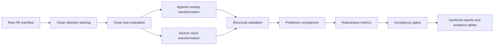

# BinaryShield: PE-Aware Robustness Auditing for Malware Detection After an Image-Space Adversarial Robustness Study

## Abstract

This paper presents the final CenTaD-MalGuard / BinaryShield research project as an evidence-based progression from malware-image adversarial robustness to raw Windows PE robustness auditing. The original MalGuard cycle evaluated lightweight malware image classifiers on a duplicate-aware MalImg protocol and found that high clean performance did not imply adversarial reliability: MobileNetV3 reached clean accuracy `0.979211` and clean macro F1 `0.935261`, but fell to PGD-20 accuracy `0.002867` and PGD-20 macro F1 `0.000706`. A first MobileNetV3 PGD adversarial-training baseline improved attacked accuracy, but PGD-20 macro F1 remained only `0.031593`, exposing family-balanced failure. A later FB-MalAT continuation using EfficientNet-B0, Balanced Softmax, balanced sampling, PGD-20 training, and robust-min validation over PGD-20 and PGD-50 achieved the aggregate 80/80 target on the duplicate-aware MalImg test protocol: FGSM accuracy/macro F1 `0.886022`/`0.851871`, PGD-20 `0.870968`/`0.827654`, and PGD-50 `0.836559`/`0.804148`. This is reported as aggregate image-space robustness, not per-family robustness, because worst-family F1 remained `0.000000`.

Those findings motivated BinaryShield, a PE-aware malware robustness auditing framework that operates on raw Windows PE files rather than only image representations. BinaryShield builds manifests, trains transparent PE and byte-level detectors, applies controlled append-overlay and section-slack transformations, validates transformed files structurally, compares detectors, and exports sanitized robustness evidence. On the accepted Dike evidence package, the class-balanced `byte_histogram_logistic` detector achieved append robust-min macro F1 `0.977220`, slack robust-min macro F1 `0.980882`, prediction stability `1.000000`, attack success rate `0.000000`, and acceptance status `PASS`. BinaryShield was then externally evaluated on a reproducible balanced PEMML subset of 10,000 raw PE files: 5,000 malware and 5,000 benign samples. On that subset, `byte_histogram_logistic` achieved clean macro F1 `0.906000`, append robust macro F1 `0.894983`, slack robust macro F1 `0.889822`, append prediction stability `0.993980`, slack prediction stability `0.996986`, append attack success rate `0.004474`, and slack attack success rate `0.001691`. The PEMML candidate did not fully pass acceptance: the strict `Slack executable sections unchanged` gate observed `0.9984951091045899` against a target of `>= 1.00`. This caveat is central to the result. BinaryShield did not hide the failure; it surfaced a protocol-level transformation issue, supporting the framework's role as an audit system rather than a marketing claim of universal malware robustness.

## Keywords

Malware detection; PE files; robustness auditing; adversarial machine learning; malware image classification; byte histogram; logistic regression; append overlay; section slack; structural validation; BinaryShield; CenTaD-MalGuard.

## 1. Introduction

Machine-learning malware detectors are often evaluated on clean test accuracy, yet cybersecurity systems operate in adversarial settings. A malware detector that performs well on unmodified test samples may still be unreliable if small, strategically chosen input changes cause misclassification. The original project began with this concern in a malware-image setting: malware binaries were represented as grayscale images and classified into families using lightweight neural networks. That phase produced an important result: clean malware image accuracy can be high while adversarial robustness is extremely weak.

The final project direction is BinaryShield. BinaryShield moves the robustness question closer to realistic executable files by auditing raw Windows PE files under controlled structural transformations. Instead of asking only whether an image classifier is stable under pixel perturbations, BinaryShield asks whether malware detectors remain stable when PE files are modified in regions that should not alter checked executable content: appended overlay bytes and non-executable section slack bytes. The framework then validates transformed files, computes robustness metrics, compares detectors, and exports sanitized evidence.

The central claim of this paper is deliberately bounded. BinaryShield does not prove malware behavior preservation, does not claim universal evasion resistance, and does not compare against commercial antivirus. It supports a narrower but more defensible claim: under the evaluated append/slack threat model and static validation protocol, a class-balanced byte-histogram logistic detector remained highly stable on the accepted Dike evidence package and on a balanced 10,000-sample PEMML external subset, while the framework also detected a narrow section-slack validation failure on PEMML.

## 2. Background and Motivation

### 2.1 Malware Image Classification

Malware image classification converts binary files into image-like arrays and applies computer-vision models to classify malware families. This approach is useful for demonstrating machine-learning vulnerabilities because it permits standard image architectures, gradient-based attacks, and visual explanation tools. However, image-space perturbations are an indirect proxy for executable-file manipulation. A perturbation that is small in image space does not necessarily correspond to a valid or meaningful PE-file modification.

### 2.2 Adversarial Attacks and Training

FGSM is a one-step gradient attack used as a fast sensitivity probe and follows the adversarial-example formulation introduced by Goodfellow et al. PGD is an iterative projected-gradient attack and follows the stronger first-order adversary framing popularized by Madry et al. PGD adversarial training augments training with adversarial examples. In the MalGuard phase, the first MobileNetV3 PGD-trained baseline improved attacked accuracy but did not solve family-balanced robustness; the later FB-MalAT EfficientNet-B0 continuation reached aggregate 80/80 accuracy and macro F1 under FGSM, PGD-20, and PGD-50, while still leaving worst-family failures.

### 2.3 Raw PE Robustness

Windows PE files have structured headers, sections, entry points, and raw section data. Some byte regions are more appropriate for robustness audits than others. Appending bytes after declared section data can test overlay sensitivity. Modifying slack space in non-executable sections can test sensitivity to padding-like bytes. These transformations are not universal semantic guarantees, but they are closer to executable-file robustness than unconstrained image perturbations.

### 2.4 Byte-Histogram Logistic Detection

The final BinaryShield detector is `byte_histogram_logistic`, a transparent class-balanced logistic detector trained on 256 normalized byte-frequency features. Source audit shows that each byte bin is a normalized frequency, the logistic model fits train-split mean and standard deviation only on training rows, uses inverse-frequency sample weighting, and calibrates its decision threshold on validation macro F1. This makes it simpler and more inspectable than a neural raw-byte detector, while still more expressive than a centroid baseline.

## 3. Problem Statement

The project addresses two linked problems. First, clean malware classifier accuracy can misrepresent security reliability because adversarial perturbations can collapse performance. Second, image-space malware robustness is not sufficient as a final cybersecurity solution because real malware detectors operate on executable files and must account for file structure. The final problem is therefore: can we build a reproducible, judge-facing, raw-PE robustness audit pipeline that evaluates detector stability under controlled PE transformations while explicitly reporting validation failures and claim boundaries?

## 4. Research Questions

- RQ1: How fragile are lightweight malware image classifiers under adversarial perturbations despite high clean accuracy?
- RQ2: Which training changes moved the image-space model from baseline fragility toward the aggregate 80/80 adversarial target?
- RQ3: Can a raw-PE robustness audit framework provide a more realistic and judge-facing cybersecurity solution than image-space adversarial demos?
- RQ4: How stable is a clean-trained byte-histogram logistic malware detector under append-overlay and section-slack PE transformations?
- RQ5: Does BinaryShield's validation protocol detect unsafe or ambiguous transformation cases instead of overclaiming robustness?
- RQ6: How well do BinaryShield results generalize beyond the initial Dike validation to a separate PEMML external subset?

## 5. Contributions

This project makes seven contributions.

1. It documents a duplicate-aware MalImg evaluation cycle showing that lightweight malware image classifiers can be highly accurate and still brittle under FGSM and PGD attacks.
2. It records the initial MobileNetV3 PGD-adversarial-training result, which improved robustness without increasing model size but still left weak PGD-20 family-balanced performance.
3. It documents the later FB-MalAT 80/80 improvement process: Balanced Softmax, balanced sampling, EfficientNet-B0 capacity, PGD-20 continuation from a PGD-10 checkpoint, and robust-min validation across PGD-20 and PGD-50.
4. It reframes the final project from image-space adversarial demos to raw-PE robustness auditing.
5. It implements BinaryShield, a PE-aware pipeline for manifests, detector training, append/slack transformations, structural validation, detector comparison, and sanitized evidence export.
6. It provides accepted Dike evidence where `byte_histogram_logistic` is the strongest confirmed detector under the evaluated append/slack threat model.
7. It provides external PEMML subset evidence on 10,000 raw PE files, including a visible acceptance caveat where BinaryShield detects a narrow slack validation issue.

## 6. Related Work / Literature Context

The project is related to four areas: malware image classification, adversarial machine learning, PE malware detection, and software security evaluation. Malware image classification was popularized for malware family recognition by Nataraj et al., whose work motivates the original MalImg-style image representation. Adversarial ML motivates FGSM, PGD, and adversarial training: Goodfellow et al. introduced FGSM as a fast linearized adversarial perturbation method, while Madry et al. framed PGD adversarial training as optimization against a strong first-order adversary. Grad-CAM motivates the supporting image-phase attention analysis, but the paper treats it only as interpretability evidence. PE malware detection motivates raw-byte and structural features, while the Microsoft PE/COFF specification motivates conservative PE-structure validation. Security evaluation motivates acceptance gates, negative-result reporting, and sanitized evidence export.

The paper follows a standard empirical machine-learning structure: problem and research questions, related work, dataset protocol, method, threat model, metrics, experiments, results, discussion, limitations, ethics, and reproducibility appendices. This structure is consistent with the reporting expectations behind modern ML conference reproducibility checklists: claims are tied to dataset splits, model choices, training configuration, metrics, evidence files, and limitations rather than being presented as unbounded security guarantees.

## 7. MalGuard Image-Space Experimental Cycle

The original CenTaD-MalGuard cycle used MalImg malware images and lightweight neural classifiers. The official protocol corrected an early data-leakage risk by using a duplicate-aware split: content hashes were grouped so identical image content did not cross train, validation, and test. The official split contained 6,539 train samples, 1,405 validation samples, and 1,395 test samples according to the final image-phase report.

MobileNetV3 Small was the primary lightweight model. It reached clean accuracy `0.979211` and clean macro F1 `0.935261`. EfficientNet-B0 was evaluated as a higher-capacity comparison, but MobileNetV3 had the stronger clean deployment tradeoff in the final report.

The robustness evaluation showed severe fragility. At FGSM epsilon 0.03, MobileNetV3 accuracy dropped to `0.180645` and macro F1 to `0.032209`. Under PGD-20, accuracy dropped to `0.002867` and macro F1 to `0.000706`. This directly answers RQ1: high clean accuracy did not indicate adversarial reliability.

| Metric | Baseline MobileNetV3 | PGD-trained MobileNetV3 | Absolute change |
| --- | --- | --- | --- |
| Clean Accuracy | 0.979211 | 0.973477 | -0.005735 |
| Clean Macro F1 | 0.935261 | 0.919019 | -0.016242 |
| FGSM Accuracy eps=0.03 | 0.180645 | 0.828674 | 0.648029 |
| FGSM Macro F1 eps=0.03 | 0.032209 | 0.509615 | 0.477406 |
| PGD-20 Accuracy | 0.002867 | 0.200000 | 0.197133 |
| PGD-20 Macro F1 | 0.000706 | 0.031593 | 0.030887 |
| PGD-20 ASR | 0.997072 | 0.794551 | -0.202521 |
| Model Size MB | 5.934376 | 5.934376 | 0.000000 |

PGD adversarial training improved attacked accuracy. FGSM epsilon 0.03 accuracy increased from `0.180645` to `0.828674`. PGD-20 accuracy increased from `0.002867` to `0.200000`. However, PGD-20 macro F1 only increased from `0.000706` to `0.031593`. The model size stayed `5.934376` MB. This was a useful robustness-efficiency result, but not a complete defense.

### 7.1 FB-MalAT 80/80 Improvement Process

After the family-level audit showed PGD-20 macro F1 collapse, the training objective was changed from merely improving attacked accuracy to satisfying an aggregate 80/80 target: at least 80% test accuracy and 80% macro F1 under FGSM epsilon 0.03, PGD-20 epsilon 0.03, and PGD-50 epsilon 0.03. The successful finalist was not the vanilla MobileNetV3 PGD-trained model. It was an EfficientNet-B0 continuation trained with the FB-MalAT process recorded in `configs/defense/fb_malat/at_bsl_efficientnet_b0_pgd20_from_pgd10_robustmin.yaml`.

The improvement process had five important changes. First, the model used EfficientNet-B0, increasing representational capacity relative to MobileNetV3. Second, the loss used Balanced Softmax to account for family imbalance. Third, the dataloader used a balanced sampler so minority families were seen more often during training. Fourth, training generated PGD-20 adversarial examples online with epsilon `0.03`, alpha `0.003`, random start, and `20` steps. Fifth, checkpoint selection changed from a single PGD-20 validation metric to `val_robust_min_macro_f1`, the minimum macro F1 over validation PGD-20 and PGD-50 attacks. The final checkpoint continued from a stronger PGD-10 EfficientNet-B0 checkpoint and selected the first epoch of the PGD-20 robust-min continuation.

| Condition | Accuracy | Precision | Recall | Macro F1 | Attack success rate | Worst-family F1 | Families F1 < 0.80 |
| --- | ---: | ---: | ---: | ---: | ---: | ---: | ---: |
| Clean | 0.903943 | 0.898258 | 0.931632 | 0.898619 | n/a | 0.000000 | 3 |
| FGSM eps=0.03 | 0.886022 | 0.847590 | 0.889333 | 0.851871 | 0.019826 | 0.000000 | 5 |
| PGD-20 eps=0.03 | 0.870968 | 0.821423 | 0.866379 | 0.827654 | 0.036479 | 0.000000 | 6 |
| PGD-50 eps=0.03 | 0.836559 | 0.798288 | 0.850449 | 0.804148 | 0.074544 | 0.000000 | 7 |

This result answers RQ2. The aggregate 80/80 target was achieved for FGSM, PGD-20, and PGD-50 on the duplicate-aware MalImg image-space test protocol. The result is still bounded: worst-family F1 remained `0.000000`, so the paper does not claim that every malware family became robust. The claim is aggregate accuracy and macro-F1 robustness under evaluated image-space attacks, not executable-file robustness or universal adversarial security.

## 8. Limitations of the Original Image-Based Approach

The image phase was scientifically useful but not sufficient for the final solution. First, image perturbations do not directly correspond to valid PE transformations. Second, even after the later FB-MalAT 80/80 aggregate result, worst-family F1 remained `0.000000`, so family-level robustness was still uneven. Third, Grad-CAM attention stability was supporting evidence, not proof of malware semantics. Fourth, a judge-facing cybersecurity solution needs more than a model result: it needs a reproducible audit workflow, safety boundaries, validation gates, and sanitized evidence.

These limitations motivated BinaryShield. The goal shifted from making an image classifier appear robust to building an audit framework that can evaluate raw executable robustness claims and refuse overclaiming when validation fails.

## 9. BinaryShield System Design

BinaryShield is a PE-aware robustness auditing framework. Its pipeline is:

The framework contains dataset modules, PE parsing and feature extraction, byte loading, detector implementations, mutation-region discovery, transformations, validation, evaluation scripts, multi-detector comparison, robustness cards, and sanitized evidence-table export. The final solution is therefore not merely a user interface. It is an auditable evaluation pipeline.

## 10. Threat Model

BinaryShield evaluates stability under static PE-preserving transformation attempts. The attacker is modeled as changing bytes in append overlay or non-executable section slack regions without changing the checked executable sections or entry point. The detector is evaluated before and after transformation. An attack succeeds when a sample that was correctly predicted before transformation becomes incorrect after transformation. This threat model is intentionally narrow. It does not cover arbitrary packing, import-table rewriting, code injection, semantic malware behavior changes, dynamic evasion, or commercial antivirus bypass.

## 11. Dataset Protocols

### 11.1 MalImg

MalImg supported the original image-space adversarial cycle. It was evaluated with a duplicate-aware 70/15/15-style protocol documented in the final image-phase report. The project used this phase to demonstrate the weakness of clean accuracy as a security metric.

### 11.2 DikeDataset

DikeDataset supported the accepted raw-PE BinaryShield evidence. The sanitized Dike manifest summary reports `9932` PE-parseable manifest rows from `11923` label rows, with split counts `{'train': 6952, 'val': 1489, 'test': 1491}` and label counts `{'malware': 8970, 'benign': 962}`. The Dike acceptance report status is `PASS` for the `byte_histogram_logistic` candidate.

### 11.3 PEMML

PEMML provided external validation. The extracted `samples.csv` contained `201549` rows. The evaluated final subset was balanced: 5,000 malware samples and 5,000 benign samples, split into `7000` train, `1500` validation, and `1500` test rows. This is not full PEMML validation. The full dataset was not run because the project scope prioritized a reproducible, resource-bounded external subset.

## 12. Detectors Evaluated

BinaryShield evaluated centroid and logistic detector families.

- `pe_feature_centroid`: a centroid baseline over 21 PE structural features.
- `byte_histogram_centroid`: a centroid baseline over 256 normalized byte-frequency bins.
- `hybrid_centroid`: a centroid baseline over 21 PE features plus 256 byte-histogram bins.
- `byte_histogram_logistic`: a class-balanced logistic detector over 256 normalized byte-frequency bins with train-split standardization and validation threshold calibration.

Centroid detectors are intentionally simple baselines. They are transparent, but they can be weak when raw feature scales differ or class boundaries are not centroid-like. Logistic regression can outperform them because it learns weighted linear evidence over byte-frequency bins and handles class imbalance explicitly.

## 13. PE-Preserving Transformations

BinaryShield evaluates two transformations.

Append overlay adds deterministic pseudo-random bytes at the file end. It is Level 2 only when appending does not overwrite declared section raw data. Section slack modifies unused slack bytes inside non-executable sections. The code excludes executable/code sections by default for Level 2 evaluation.

These transformations are structural approximations. They are useful for robustness auditing, but they are not universal semantic guarantees. Imports, exports, resources, relocations, and certificate tables are not separately compared in the current validation code unless they are indirectly protected by unchanged sections or unmodified regions.

## 14. Validation and Safety Protocol

BinaryShield validates transformed files before using them for robustness claims. Level 1 requires both original and transformed files to parse as PE files, the transformed hash to differ, the entry point to remain unchanged, and the section count to remain unchanged. Level 2 adds executable-section preservation and requires the expected transformation level to be at least 2. Level 3 exists as a future field requiring sandbox execution status `passed`, but no source path currently performs sandbox execution.

This validation protocol is central to the project's honesty. The PEMML 5k+5k run produced strong metric results but failed one strict structural gate. Instead of treating this as an inconvenience, the paper treats it as a useful audit finding.

## 15. Experimental Setup

The image-phase experiments used duplicate-aware MalImg splits, MobileNetV3 Small, EfficientNet-B0, FGSM, PGD, PGD adversarial training, Balanced Softmax, balanced sampling, robust-min checkpoint selection, and Grad-CAM supporting analysis. The final FB-MalAT 80/80 checkpoint was evaluated on clean, FGSM epsilon 0.03, PGD-20 epsilon 0.03, and PGD-50 epsilon 0.03 test conditions. The BinaryShield experiments used clean-trained detectors on raw PE manifests, evaluated on test split rows before and after append/slack transformations. Dike was used as the accepted initial PE evidence. PEMML was used as a second external subset: 10,000 balanced raw PE samples.

No new expensive experiment was run for this paper. The paper synthesizes existing reports and sanitized outputs.

## 16. Evaluation Metrics

Macro F1 measures family/class-balanced performance and is more informative than accuracy under imbalance. Robust macro F1 is the minimum of clean and transformed macro F1 for a transformation. Prediction stability is the fraction of evaluated predictions that remain unchanged after transformation. Attack success rate is computed over samples that were correctly classified before transformation and then became incorrect after transformation. Validation coverage records whether transformation validation JSON exists and whether parse, entry-point, executable-section, and Level 2 checks pass. Acceptance gates combine model metrics and structural validation requirements.

## 17. Results

### 17.1 MalGuard Image-Phase Results

The MalGuard image cycle showed that clean accuracy was not enough. MobileNetV3's clean accuracy was `0.979211` but PGD-20 accuracy was `0.002867`. The first MobileNetV3 PGD adversarial-training result improved PGD-20 accuracy to `0.200000`, but PGD-20 macro F1 remained `0.031593`. The later FB-MalAT EfficientNet-B0 continuation reached the aggregate 80/80 target under FGSM, PGD-20, and PGD-50, while preserving an explicit worst-family caveat.

| Model / training process | Clean acc. | Clean macro F1 | FGSM acc. | FGSM macro F1 | PGD-20 acc. | PGD-20 macro F1 | PGD-50 acc. | PGD-50 macro F1 |
| --- | ---: | ---: | ---: | ---: | ---: | ---: | ---: | ---: |
| MobileNetV3 clean baseline | 0.979211 | 0.935261 | 0.180645 | 0.032209 | 0.002867 | 0.000706 | n/a | n/a |
| MobileNetV3 PGD adversarial training | 0.973477 | 0.919019 | 0.828674 | 0.509615 | 0.200000 | 0.031593 | n/a | n/a |
| FB-MalAT EfficientNet-B0 robust-min continuation | 0.903943 | 0.898619 | 0.886022 | 0.851871 | 0.870968 | 0.827654 | 0.836559 | 0.804148 |

### 17.2 Dike BinaryShield Results

| Dataset | Transformation | Detector | Robust-min macro F1 | Prediction stability | Attack success rate | Evaluated samples | Acceptance |
| --- | --- | --- | --- | --- | --- | --- | --- |
| Dike | append_overlay | byte_histogram_logistic | 0.977220 | 1.000000 | 0.000000 | 1490 | PASS |
| Dike | section_slack | byte_histogram_logistic | 0.980882 | 1.000000 | 0.000000 | 1477 | PASS |

The Dike evidence supports the strongest confirmed BinaryShield detector claim. `byte_histogram_logistic` achieved high robust-min macro F1 under append and slack transformations, with prediction stability `1.000000` and attack success rate `0.000000`. The Dike acceptance report status is `PASS`.

### 17.3 PEMML Smoke and External Subset Results

| Stage | Rows | Composition | Clean macro F1 | Append robust macro F1 | Slack robust macro F1 | Append stability | Slack stability | Acceptance |
| --- | --- | --- | --- | --- | --- | --- | --- | --- |
| 1k+1k smoke | 2,000 | 1,000 malware + 1,000 benign | 0.883322 | 0.874999 | 0.863145 | 1.000000 | 1.000000 | FAIL |
| 5k+5k subset | 10,000 | 5,000 malware + 5,000 benign | 0.906000 | 0.894983 | 0.889822 | 0.993980 | 0.996986 | FAIL |

The 1k+1k PEMML run is a smoke test. The 5k+5k PEMML run is the main external subset validation. It evaluates 10,000 balanced raw PE files, not the full PEMML dataset.

### 17.4 PEMML 5k+5k Metrics

| Metric | Value | Interpretation |
| --- | --- | --- |
| Clean macro F1 | 0.906000 | Clean external subset performance |
| Append robust macro F1 | 0.894983 | Robust performance under append-overlay transformation |
| Slack robust macro F1 | 0.889822 | Robust performance under section-slack transformation |
| Append prediction stability | 0.993980 | Fraction of predictions unchanged under append overlay |
| Slack prediction stability | 0.996986 | Fraction of predictions unchanged under section slack |
| Append attack success rate | 0.004474 | Evasion rate among originally correct evaluated samples |
| Slack attack success rate | 0.001691 | Evasion rate among originally correct evaluated samples |
| Candidate acceptance | FAIL | Failed strict slack executable-section validation gate |

The append macro F1 drop from clean was `0.011017`. The slack macro F1 drop from clean was `0.016178`. These are mild drops under the evaluated threat model.

### 17.5 PEMML Detector Comparison

| Detector | Robust-min macro F1 | Min prediction stability | Max attack success rate | Min worst-class F1 |
| --- | --- | --- | --- | --- |
| byte_histogram_centroid | 0.662364 | 0.975885 | 0.028921 | 0.659056 |
| byte_histogram_logistic | 0.889822 | 0.993980 | 0.004474 | 0.876712 |
| hybrid_centroid | 0.353073 | 1.000000 | 0.000000 | 0.084942 |
| pe_feature_centroid | 0.353073 | 1.000000 | 0.000000 | 0.084942 |

The logistic detector had the strongest robust-min macro F1 among evaluated PEMML detectors. Its robust-min macro F1 was `0.889822`, compared with `0.662364` for `byte_histogram_centroid` if sorted alphabetically. More importantly, the full detector comparison table shows that logistic achieved the best balance of robust macro F1, worst-class F1, and low attack success rate.

### 17.6 Acceptance Gate Result

The PEMML 5k+5k candidate acceptance status is `FAIL`. The failed gate was `Slack executable sections unchanged`, observed `0.9984951091045899` against target `>= 1.00`. This is a narrow failure: the observed rate is very close to the target, but the strict gate requires perfect preservation. The failure does not invalidate the metric robustness result. It does mean the project must not claim a full PEMML protocol pass.

### 17.7 PEMML Statistical Confidence and Paired Tests

The PEMML 5k+5k run now includes paired statistical analysis over transformation-evaluable prediction records. The full-test clean macro F1 remains `0.906000`; the intervals below are computed on rows where both clean and transformed predictions were present. With 2,000 bootstrap resamples and seed `1337`, append transformed macro F1 was `0.894983` with 95% CI `[0.880152, 0.910294]`, append prediction stability was `0.993980` with CI `[0.989967, 0.997324]`, and append attack success rate was `0.004474` with CI `[0.001479, 0.008240]`. Slack transformed macro F1 was `0.889904` with CI `[0.873175, 0.906477]`, slack prediction stability was `0.996986` with CI `[0.993971, 0.999246]`, and slack attack success rate was `0.001691` with CI `[0.000000, 0.004237]`.

The paired clean-minus-append macro-F1 delta was `0.002000` with CI `[-0.001516, 0.005996]`. The paired clean-minus-slack delta was `-0.000082` with CI `[-0.003163, 0.002934]`. These paired intervals include zero, so the observed append/slack drops are small and not distinguishable from zero under this paired bootstrap analysis. McNemar-style exact paired tests gave `p=0.507812` for clean versus append correctness and `p=1.000000` for clean versus slack correctness.

Detector-vs-detector paired tests on shared transformed sample IDs strongly favored `byte_histogram_logistic` over centroid baselines. For example, logistic versus `byte_histogram_centroid` produced exact-binomial McNemar p-values of `2.0285e-51` on append and `2.26181e-52` on slack. This supports the claim that the logistic detector outperformed the centroid baselines on the same PEMML subset, while remaining within the evaluated threat model.

### 17.8 External Traditional Baseline: ClamAV Status

A scan-only ClamAV baseline was added to address the criticism that BinaryShield compares only project-authored detectors. ClamAV was installed on RunPod (`clamscan` version `0.103.12`) and a safe baseline script was added. The script uses `clamscan --no-summary` and does not use destructive options such as `--remove`, `--move`, or `--copy`. However, FreshClam could not obtain an official signature database: `/var/lib/clamav` contained only `freshclam.dat`, and FreshClam reported CDN 403/429 cooldown until `2026-06-27 14:17:16`.

Because no official signature database was available, no ClamAV PEMML metric is reported. This is an objective external blocker. Running ClamAV without signatures would be misleading, so the paper records the baseline as prepared but blocked rather than fabricating a comparison. The intended interpretation remains protocol-oriented: BinaryShield can audit learned detectors and traditional signature scanners under the same scan-only PE transformation workflow once signatures are available.

### 17.9 Slack Validation Root Cause

The narrow PEMML slack acceptance failure was audited at the validation-record level. Out of `1329` slack validation records, `1327` passed executable-section preservation and `2` failed. Both failures were classified as `out_of_file_slack_append_within_declared_executable_raw_extent`. The mutation records targeted slack in later non-executable sections, but the selected raw offsets were beyond the original file length. Python `bytearray` slice assignment beyond EOF appended data at the file end. In both cases the original PE declared an executable/code section raw extent past EOF, so the appended bytes changed the executable-section byte range compared by the validator.

This is a real transformer edge case on malformed or truncated PE layouts, not a reason to weaken the gate. The transformer has been tightened to skip section-slack regions whose raw byte ranges are not fully present in the source file. The original PEMML 5k+5k acceptance status remains `FAIL` because the full 5k+5k slack validation was not rerun after the code fix.

## 18. Key Findings

Finding 1: The original malware image classifier achieved strong clean performance but was highly vulnerable to adversarial attacks, especially PGD.

Finding 2: Vanilla MobileNetV3 PGD adversarial training improved robustness without increasing model size, but did not produce sufficiently strong family-balanced PGD-20 robustness.

Finding 3: The later FB-MalAT EfficientNet-B0 robust-min continuation achieved the aggregate 80/80 image-space target under FGSM, PGD-20, and PGD-50, but worst-family F1 remained `0.000000`.

Finding 4: BinaryShield reframed the project from image perturbation to raw PE transformation robustness, producing a more realistic cybersecurity audit tool.

Finding 5: On Dike, `byte_histogram_logistic` was the strongest confirmed detector and achieved very strong append/slack robustness in sanitized accepted results.

Finding 6: On the external PEMML 5k+5k subset, the clean-trained `byte_histogram_logistic` model remained highly stable under append and slack transformations.

Finding 7: Append and slack transformations only mildly degraded the clean-trained model on PEMML, with macro-F1 drops `0.011017` and `0.016178`.

Finding 8: The PEMML run did not fully pass acceptance because the strict slack structural validation gate failed narrowly. The root cause was traced to two out-of-file slack mutations on malformed or truncated PE layouts, and the transformer now skips such regions rather than appending beyond EOF.

## 19. Discussion

The byte-histogram logistic detector's stability is plausible because bounded append and slack transformations generally change the global byte distribution only slightly. A 256-bin normalized histogram is insensitive to byte position; adding or modifying a limited number of bytes may move frequencies without radically changing the learned linear score. Class balancing also helps prevent the classifier from simply optimizing for the majority class.

The image-space 80/80 result is also methodologically informative. The successful FB-MalAT process did not come from a single trick: it combined stronger capacity, imbalance-aware optimization, adversarial examples during training, and robust-min validation. The comparison against the earlier MobileNetV3 PGD-trained baseline shows why macro F1 and robust-min selection mattered. Accuracy alone would have overstated progress; macro F1 exposed family imbalance, and worst-family F1 still prevents a per-family robustness claim.

This stability should not be overstated. Byte histograms ignore imports, control flow, API usage, strings, packing structure, and semantic behavior. A detector can be stable under append/slack changes and still fail under packing, code-level transformations, or adversarially optimized semantic-preserving edits. The result supports BinaryShield's usefulness as an auditing framework under a specific threat model, not universal malware robustness.

The PEMML acceptance failure is especially important. A less rigorous project might report only the high stability and low attack success rate. BinaryShield instead reports that section-slack validation did not perfectly preserve executable sections for every validation record. The slack-region selection has now been tightened to skip raw ranges beyond EOF. The next engineering step is to rerun the PEMML 5k+5k slack validation under the patched transformer and confirm whether the strict acceptance gate passes without reducing coverage improperly.

## 20. Limitations

- PEMML was evaluated only as a 5k+5k balanced subset, not the full dataset.
- No commercial antivirus comparison was run.
- No dynamic execution or behavioral equivalence validation was performed.
- PE-preserving transformations are structural approximations, not full semantic guarantees.
- Byte-histogram detection may miss semantic malware behavior.
- Dataset age, source, and collection artifacts may affect generalization.
- The FB-MalAT 80/80 result is aggregate image-space robustness only; worst-family F1 remained `0.000000`.
- The PEMML candidate failed one strict structural acceptance gate and must not be described as a full protocol pass.
- PEMML family-level robustness is not available in current sanitized artifacts.
- Dike reproduction from raw files was not rerun locally in the final paper-writing step; the paper uses the accepted sanitized Dike evidence package.

## 21. Ethics and Safety

The project handled real malware only as inert files. The PEMML archive and extracted samples remained outside Git. Sample files had execute permissions removed on RunPod. The project did not execute malware dynamically. Committed evidence is limited to sanitized metrics, aggregate JSON/CSV/Markdown summaries, and reports. The paper does not include raw malware paths, PE filenames, transformed binaries, archives, or model artifacts.

## 22. Future Work

Immediate future work should rerun the PEMML 5k+5k slack validation under the tightened slack-region guard and confirm whether the strict gate passes without weakening validation. ClamAV baseline execution should resume only after an official signature database is available; optional YARA evaluation should include documented rules. The current authorized PEMML ceiling remains 5k+5k; 10k+10k or full PEMML should not be run without explicit later authorization. Dynamic sandbox validation should only be added in an isolated malware-analysis environment. Richer PE features, import-table features, and neural raw-byte models may improve detection, but should be added only after the current validation protocol is stable. A final judge-facing dashboard can then summarize robustness cards without exposing unsafe artifacts.

## 23. Conclusion

The project began with a conventional malware-image adversarial robustness question and ended with a more realistic PE-aware robustness audit framework. The MalGuard image phase showed that high clean accuracy can collapse under PGD, that vanilla MobileNetV3 PGD training improves but does not solve robustness, and that a later FB-MalAT EfficientNet-B0 robust-min continuation can reach an aggregate 80/80 image-space target while still leaving weak-family caveats. BinaryShield transformed that lesson into a raw-PE evaluation pipeline with detector comparison, append/slack transformations, structural validation, acceptance gates, robustness cards, and sanitized evidence export.

The final evidence is strong but bounded. Dike accepted the `byte_histogram_logistic` detector with high append/slack robustness and full acceptance. PEMML externally evaluated the same detector on a balanced 10,000-sample subset and observed high clean macro F1, high transformed macro F1, high prediction stability, and low attack success rates. However, the PEMML candidate failed one strict structural validation gate. That caveat is not a footnote; it is evidence that BinaryShield behaves like an audit framework. It reports when the evidence supports robustness and when the validation protocol blocks overclaiming.

## Final Verdict

The strongest supported claim is that BinaryShield provides a reproducible PE-aware robustness audit pipeline. Under the evaluated append/slack threat model, the best clean-trained byte-histogram logistic detector remained highly stable on Dike and PEMML subset evidence. Statistical analysis suggests append/slack did not significantly degrade the best detector on PEMML. The project does not prove universal malware functionality preservation or commercial antivirus superiority.

## References

### Project Evidence References

- `reports/executive_summary.md` and `reports/final_research_report.md` for the original MalGuard image-phase narrative and metrics.
- `results/defenses/adversarial_training/mobilenet_v3_small_pgd_adversarial_training_20260601T114339Z/adversarial_training_comparison.csv` for adversarial-training metrics.
- `reports/fb_malat/malguard_x_80_80_verified_result.md` and `reports/fb_malat/malguard_x_80_80_progress.md` for the aggregate 80/80 FB-MalAT result and training-process ledger.
- `results/fb_malat/final_evaluations_pgd20_continuation/efficientnet_b0_20260612T200838Z/metrics.csv` and `evaluation_metadata.json` for the final FGSM, PGD-20, and PGD-50 evaluation.
- `configs/defense/fb_malat/at_bsl_efficientnet_b0_pgd20_from_pgd10_robustmin.yaml` for the FB-MalAT training process configuration.
- `docs/binaryshield_feature_and_detector_audit.md` for source-grounded feature and detector definitions.
- `docs/binaryshield_transformation_validation_audit.md` for append/slack transformation and validation semantics.
- `docs/binaryshield_acceptance_gates.md` for acceptance-gate definitions and claim boundaries.
- `reports/binaryshield/dike_logistic_candidate_import/` and `reports/binaryshield/dike_logistic_candidate_reports_import/` for accepted Dike evidence.
- `reports/binaryshield_pemml_validation_results.md` and `reports/binaryshield/pemml_5k_5k_sanitized_metrics/` for external PEMML subset evidence.

### External References

- L. Nataraj, S. Karthikeyan, G. Jacob, and B. S. Manjunath, "Malware Images: Visualization and Automatic Classification," ACM VizSec, 2011. https://dl.acm.org/doi/10.1145/2016904.2016908
- I. J. Goodfellow, J. Shlens, and C. Szegedy, "Explaining and Harnessing Adversarial Examples," arXiv:1412.6572, 2014. https://arxiv.org/abs/1412.6572
- A. Madry, A. Makelov, L. Schmidt, D. Tsipras, and A. Vladu, "Towards Deep Learning Models Resistant to Adversarial Attacks," ICLR, 2018. https://arxiv.org/abs/1706.06083
- R. R. Selvaraju et al., "Grad-CAM: Visual Explanations from Deep Networks via Gradient-Based Localization," ICCV, 2017. https://openaccess.thecvf.com/content_ICCV_2017/html/Selvaraju_Grad-CAM_Visual_Explanations_ICCV_2017_paper.html
- Microsoft, "Microsoft Portable Executable and Common Object File Format Specification." https://learn.microsoft.com/en-us/windows/win32/debug/pe-format
- Iosifache, "DikeDataset," public GitHub repository. https://github.com/iosifache/DikeDataset
- Practical Security Analytics, "PE Malware Machine Learning Dataset." https://practicalsecurityanalytics.com/pe-malware-machine-learning-dataset/
- NeurIPS, "Paper Checklist Guidelines," used as a reporting reference for dataset, metric, reproducibility, and limitation disclosure. https://neurips.cc/public/guides/PaperChecklist

## Appendices

### Appendix A: Verified Metrics Summary

See `reports/final_binaryshield_verified_metrics_summary.md`.

### Appendix B: Generated Tables

- `reports/final_binaryshield_research_paper_tables/malimg_adversarial_training.csv`
- `reports/final_binaryshield_research_paper_tables/fb_malat_80_80_metrics.csv`
- `reports/final_binaryshield_research_paper_tables/dike_metrics.csv`
- `reports/final_binaryshield_research_paper_tables/pemml_stages.csv`
- `reports/final_binaryshield_research_paper_tables/pemml_5k_metrics.csv`
- `reports/final_binaryshield_research_paper_tables/pemml_detector_comparison.csv`

### Appendix C: Generated Figures

- `reports/final_binaryshield_research_paper_figures/malimg_clean_fgsm_pgd_accuracy.png`
- `reports/final_binaryshield_research_paper_figures/pemml_5k_macro_f1.png`
- `reports/final_binaryshield_research_paper_figures/pemml_5k_prediction_stability.png`
- `reports/final_binaryshield_research_paper_figures/pemml_5k_attack_success_rate.png`

### Appendix D: Claim Boundary

BinaryShield can claim evaluated robustness under append-overlay and section-slack transformations that pass its static validation checks. It cannot claim malware behavior preservation, universal adversarial robustness, full PEMML validation, commercial antivirus superiority, or Level 3 semantic preservation.
